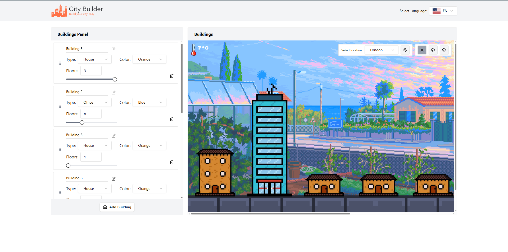

# City Builder



City Builder is a project that allows users to manage and visualize a city with various buildings. Users can customize buildings, view them in a content block, and simulate weather conditions for the selected city.

Check out the demo [here](https://city-builder-7jcd.vercel.app/).

## Features

- **Builder Cards**: Manage every building with options to set the number of floors, color, and building type.
- **Content Block**: Display all the buildings in a visual format.
- **Weather Simulation**: Simulate weather conditions and fetch real-time weather and temperature data for the selected city.

## Getting Started

### Prerequisites

- Node.js version `>=22.13.8`
- pnpm (Package Manager)

### Installation

1. Clone the repository:
   ```sh
   git clone https://github.com/dhwind/city-builder.git
   ```
2. Navigate to the project directory:
   ```sh
   cd city-builder
   ```
3. Install the dependencies:
   ```sh
   pnpm install
   ```

### Running the Project

To start the development server, run:

```sh
pnpm build && pnpm start
```

## Usage

1. **Manage Buildings**: Use the builder cards to add, edit, or remove buildings. Customize each building by setting the number of floors, color, and type.
2. **View Buildings**: The content block will display all the buildings you have added.
3. **Weather Simulation**: Select a city to fetch and display real-time weather and temperature data. Use the weather simulation feature to see how different weather conditions affect your city.

## Contributing

Contributions are welcome! Please fork the repository and create a pull request with your changes.

## License

This project is licensed under the MIT License. See the [LICENSE](LICENSE) file for details.
